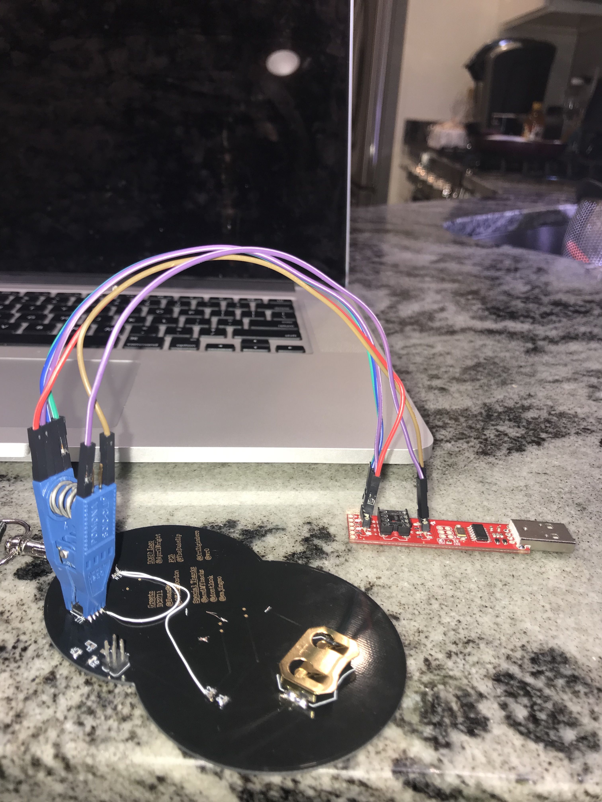

# DC617 Badge challenge for DC26

Credits to [@Eber24](https://twitter.com/eber) & [@sajingeo](https://github.com/sajingeo) for the CODE.

Credits to [@TheDukeZip](https://twitter.com/TheDukeZip) for the PCB!! and amazing design!!

Credits to [@AprilWright](https://twitter.com/aprilwright) for the DC617 Logo

## Special Thanks
@andMYhacks

@dontlook

@wr0

@OriZigindere

## Resources
board support https://cdn.sparkfun.com/assets/learn_tutorials/1/5/0/attiny-ide-1.6.x.zip

place the atiny folder in /Documents/Arduino/hardware

i2c library https://github.com/lucullusTheOnly/TinyWire

place the TineyWire folder in /Documents/Arduino/library

### How to program the attiny85 SOIC 
https://learn.sparkfun.com/tutorials/tiny-avr-programmer-hookup-guide/all

### Setup the board

Cut the traces

Solder the I2C Pullups and the IC (U1)

### Program the IC (using Tiny ISP)
I used the Tiny programmer from sparkfun to program the IC, The ATTiny85v will work at 1.8v to 5v.

more details on the hookup here.
https://learn.sparkfun.com/tutorials/tiny-avr-programmer-hookup-guide/all

### Programm the IC (using bus pirate)
use brew to install avrdude

### MAC
brew install avrdude

#### Wiring
http://dangerousprototypes.com/docs/Bus_Pirate_AVR_Programming
http://wiki.attie.co.uk/wiki/Avrdude

### Windows
http://fab.cba.mit.edu/classes/863.16/doc/projects/ftsmin/windows_avr.html

### Flash hex
avrdude -c buspirate -p t85 -P /dev/tty.usbserial-MEC1 -y -U flash:w:test.hex

## NOTEs
This will not work with Bus pirate / RPI [ does not implement full i2c] [link to why](https://github.com/rambo/TinyWire)

## tools
https://www.sparkfun.com/products/13153

https://www.sparkfun.com/products/11801

https://www.sparkfun.com/products/9194
